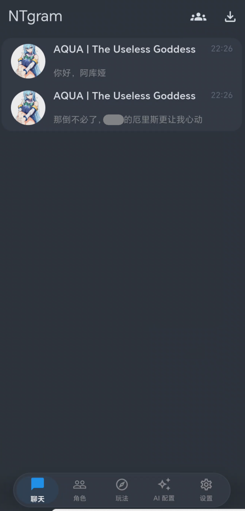
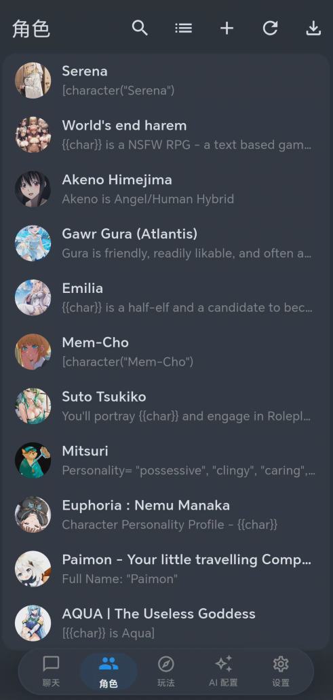
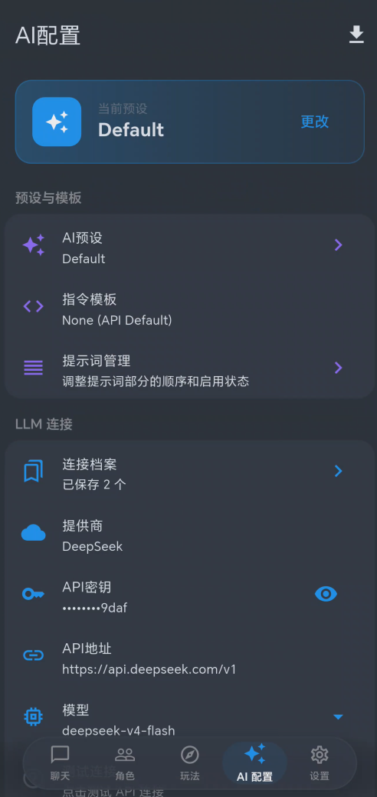

# NativeTavern

<p align="center">
  <a href="README.md">简体中文</a> | <a href="README.en.md">English</a>
</p>

<p align="center">
  🌐 <a href="https://nativetavern.com/">Native Tavern</a>
</p>

A native cross-platform mobile application (iOS/Android) that reimplements SillyTavern as a high-performance native app with full compatibility for SillyTavern data formats.

## Screenshots

<p align="center">
  
  
  
</p>

<p align="center">
  
  
  
</p>

| Chat | Character | AI Config |
|:---:|:---:|:---:|
| Real-time streaming chat with message actions | Character cards with avatar and details | Multi-provider LLM configuration |

| AI Preset | Prompt Manager | World Info |
|:---:|:---:|:---:|
| Import SillyTavern presets | Custom prompt ordering | Keyword-based context injection |

## Features

### Core Features ✅
- 📱 **Native Mobile App** - Built with Flutter for iOS and Android
- ⚡ **High Performance** - Optimized for mobile devices
- 🤖 **Multi-Provider LLM Support** - OpenAI, Claude, OpenRouter, Gemini, DeepSeek, Qwen, SiliconFlow, Moonshot (Kimi), Z.AI (GLM), MiniMax, Ollama, KoboldCpp, custom OpenAI-compatible endpoints
- 📦 **Full ST Compatibility** - Import/export PNG cards, CharX, JSON
- 💬 **Streaming Responses** - Real-time SSE streaming from all providers

### Character Management ✅
- 📥 **Import Formats** - PNG V2/V3, CharX (V3 spec), JSON
- 📤 **Export Formats** - PNG V3, CharX with assets, JSON
- ✏️ **Character Editor** - Create/edit characters with all fields
- 🖼️ **Avatar Support** - Custom avatars with image picker
- 📚 **Embedded Lorebooks** - Full CharX lorebook support

### Chat Features ✅
- 💬 **Message Actions** - Edit, delete, regenerate, swipe between alternatives
- 🎛️ **Swipe Picker** - Tap the swipe counter to browse/jump/delete all swipes
- 👥 **Group Chats** - Multi-character conversations with 5 response modes
- 🔖 **Bookmarks** - Create checkpoints and branch conversations
- 📝 **Author's Note** - Injection at configurable depth
- 🎭 **Personas** - User profile management with descriptions
- 📄 **HTML/Markdown** - Rich text rendering in chat messages

### World Info / Lorebook ✅
- 🌍 **Keyword Matching** - Trigger-based context injection
- 📍 **Multiple Positions** - Before/after system prompt, character defs, examples
- 🔄 **Recursion Support** - Nested keyword scanning
- 📊 **Group Scoring** - Priority-based entry selection

### Prompt Management ✅
- 📋 **Prompt Manager** - Ordering, enabling/disabling prompts
- 📥 **SillyTavern Preset Import** - Full prompts + prompt_order support
- 🎯 **Custom Prompts** - Add custom sections with role support
- 📍 **Depth Injection** - Insert prompts at specific message depths

### Advanced Settings ✅
- 🎛️ **Full Sampler Control** - Temperature, Top-P, Top-K, Min-P, Typical-P
- 🔁 **Repetition Penalty** - With configurable range
- 🎲 **Mirostat** - Mode, Tau, Eta settings
- ✂️ **Tail-Free Sampling** - TFS and Top-A support
- 🛑 **Stop Sequences** - Custom stop tokens
- 🧠 **Reasoning Effort** - Claude adaptive thinking, Gemini thinkingBudget, OpenAI reasoning_effort
- 💰 **Prompt Caching** - Claude prompt caching to cut input costs
- 🔖 **Connection Profiles** - Save named connection snapshots, switch with one tap
- 🔀 **Message Merging** - For APIs requiring strict user/assistant alternation

### Themes ✅
- 🎨 **18 Built-in Themes** - 7 dark + 11 light themes
- 🌙 **Dark Themes** - Default Dark, Midnight, Forest, Sunset, Rose, Ocean, AMOLED
- ☀️ **Light Themes** - Clean White, Warm Cream, Soft Lavender, Mint Fresh, Sky Blue, Rose Pink, Peach, Sage Green, Paper, Sepia
- 🖌️ **Theme Editor** - Full color customization

### Chain of Thought Support ✅
- 🧠 **OpenAI o1/o3** - Parse `reasoning_content` field
- 💭 **Claude** - Parse `thinking` blocks (including adaptive thinking)
- 🤔 **Gemini 2.0 Flash Thinking** - Parse `thought` field
- 🏷️ **Inline Tag Parsing** - Auto-extract `<think>` tags from DeepSeek R1 and similar models (streaming + non-streaming)
- 💾 **Reasoning Storage** - Save reasoning with messages and swipes
- 📦 **Collapsible UI** - Expandable reasoning blocks with copy support
- ⏳ **Streaming Display** - Real-time reasoning with pulse animation

### Character Tags ✅
- 🏷️ **Tag Management** - Create, edit, delete tags
- 🎨 **Tag Colors** - Custom hex colors for tags
- 😀 **Tag Icons** - Emoji icons for visual identification
- 🔗 **Character Assignment** - Assign multiple tags to characters
- 🔍 **Tag Filtering** - Filter character list by tags

### Markdown Input ✅
- ⌨️ **Keyboard Shortcuts** - ⌘B bold, ⌘I italic, ⌘U underline
- 📝 **Formatting Toolbar** - Compact toolbar with formatting buttons
- 🔗 **Link Support** - ⌘K for quick link insertion
- 💻 **Code Blocks** - Inline code and code block shortcuts

### Expression Sprites ✅
- 🎭 **Emotion Detection** - Automatic emotion detection from messages
- 📁 **Sprite Management** - Per-character sprite folders
- 🖼️ **15 Emotions** - Happy, sad, angry, surprised, scared, and more
- ✨ **Animations** - Smooth fade/scale transitions
- ⚙️ **Customizable** - Size, position, opacity settings
- 🎬 **Action Detection** - Detects *smiles*, *laughs*, etc.

### Text-to-Speech 🚧
- 🔊 **Multiple Providers** - ElevenLabs, Azure, Volcengine, GPT-SoVITS, OpenAI-compatible endpoints
- 🎭 **Per-Character Voices** - Different voice for each character
- 🎚️ **Voice Controls** - Speed, pitch, volume adjustment
- 📝 **Text Cleaning** - Removes markdown/HTML for natural speech
- ⚠️ **Status** - Synthesis APIs are wired (return audio bytes); playback integration in progress

### Speech-to-Text 🚧
- 🎤 **Voice Input** - Dictate messages using your voice (API layer ready, recording integration in progress)
- 🌍 **16 Languages** - Support for major languages
- 🔄 **Multiple Providers** - System STT, Whisper, Azure

### Translation ✅
- 🌐 **30+ Languages** - Translate between major languages
- 🔄 **Multiple Providers** - Google, DeepL, LibreTranslate
- 🔀 **Auto-translate** - Incoming and outgoing messages
- 🔍 **Language Detection** - Auto-detect source language
- 📝 **Show Original** - Display original alongside translation
- 🔘 **Translate Button** - On-demand message translation

### Image Generation ✅
- 🎨 **Multiple Providers** - GPT-Image-2, Gemini, NovelAI, Pollinations (free), ComfyUI, Automatic1111
- 📐 **Size Presets** - 512x512, 768x768, 1024x1024, and more
- ⚙️ **Generation Settings** - Steps, CFG scale, sampler selection
- 🚫 **Negative Prompts** - Exclude unwanted elements
- 🎲 **Sampler Options** - Euler, Euler A, DPM++, DDIM, and more
- 🔧 **API Configuration** - Custom endpoints and API keys

### Regex Scripts ✅
- 🔍 **Find/Replace Patterns** - Apply regex to messages
- 📝 **Script Management** - Create, edit, delete, reorder scripts
- 🎯 **Placement Options** - User input, AI output, slash commands
- 📦 **Presets** - Built-in preset scripts
- 🔄 **Import/Export** - Share scripts as JSON
- 🧪 **Test Widget** - Test patterns before applying

### Variables System ✅
- 🌐 **Global Variables** - App-wide persistent storage
- 💬 **Local Variables** - Per-chat variable storage
- 📝 **Variable Macros** - {{getvar}}, {{setvar}}, {{incvar}}, etc.
- 🔢 **Type Support** - Numbers, strings, arrays, objects
- ➕ **Operations** - Increment, decrement, add, concatenate

### Chat Backups ✅
- 💾 **Auto-Backup** - Configurable intervals (hourly, daily, weekly)
- 📁 **Chat Backups** - Individual chat exports (JSONL)
- 📦 **Full Backups** - Complete data exports (JSON)
- 🗑️ **Retention** - Automatic cleanup of old backups
- 👁️ **View/Restore** - Browse and restore backups

### Logit Bias ✅
- 🎚️ **Token Adjustment** - Increase/decrease token probabilities
- 📝 **Multiple Formats** - Plain text, verbatim {text}, token IDs [123]
- 📦 **Presets** - Save and manage bias presets
- 🔄 **Import/Export** - Share presets as JSON
- ✅ **Validation** - Real-time entry validation

### CFG Scale ✅
- 📊 **Guidance Scale** - Classifier-Free Guidance control
- ➖ **Negative Prompts** - Steer model away from content
- ➕ **Positive Prompts** - Enhance desired content
- 🎭 **Per-Character** - Character-specific CFG settings
- 💬 **Per-Chat** - Chat-specific overrides

### Token Probabilities (Logprobs) ✅
- 📈 **Probability Display** - View token probabilities
- 🎨 **Color Coding** - Visual probability indicators
- 🔄 **Alternative Tokens** - See top candidate tokens
- 📊 **Statistics** - Token count and analysis

### Tokenizer ✅
- 🔢 **Token Counting** - Accurate token estimation
- 🎨 **Visualization** - Color-coded token breakdown
- 📊 **Statistics** - Character/token ratios
- 🔧 **Multiple Tokenizers** - GPT, LLaMA, Claude, Mistral, etc.

### Vector Storage / RAG 🚧
- 🧲 **Embedding Providers** - OpenAI-compatible, SiliconFlow, Cohere, Gemini, Ollama
- 📚 **Collections** - Organize documents into collections, persisted locally
- 🔍 **Similarity Search** - Top-K with similarity threshold
- 📝 **Document Chunking** - Fixed size, sentence, paragraph
- 🎯 **Prompt Integration** - Retrieve by latest user message, inject via template
- 📤 **Import/Export** - Share collections as JSON

### Macro System ✅ (Macros 2.0)
- `{{user}}` / `{{char}}` - Persona and character names
- `{{time}}` / `{{date}}` / `{{weekday}}` - Date/time macros
- `{{random:min:max}}` / `{{roll:NdM}}` / `{{pick::...}}` (chat-stable)
- `{{if condition}}...{{else}}...{{/if}}` - Scoped conditional blocks with lazy evaluation and nesting
- `{{.localVar}}` / `{{$globalVar}}` - Variable shorthands with `= += -= ++ -- == != > < ?? ||` operators
- `{{greeting::N}}` - Indexed alternate greetings
- `{{maxContextTokens}}` / `{{maxResponseTokens}}` / `{{group}}`
- `{{idle_duration}}` / `{{lastMessage}}` / `{{lastUserMessage}}` / `{{lastCharMessage}}`

### Slash Commands ✅
- `/continue` - Continue generation
- `/regenerate` - Regenerate last message
- `/swipe` - Navigate swipes
- `/persona` - Switch persona
- `/sys` - Send system message
- `/bg` - Change background
- `/help` - Show command help
- `/clear` - Clear messages
- `/edit` - Edit last message
- `/delete` - Delete messages
- `/bookmark` - Create bookmark
- `/note` - Set author's note

### Backgrounds ✅
- 🖼️ **Custom Backgrounds** - Set chat backgrounds
- 📁 **Background Gallery** - Manage background images
- 🎚️ **Opacity Control** - Adjust background transparency
- 💬 **Per-Chat Backgrounds** - Different background per chat

## Tech Stack

| Component | Technology |
|-----------|------------|
| UI Framework | Flutter (Dart) |
| State Management | Riverpod |
| Navigation | go_router |
| Database | SQLite (drift) |
| Native Core | Rust (via FFI) |
| HTTP Client | Dio |

## Project Structure

```
native_tavern/
├── lib/                    # Flutter/Dart code
│   ├── main.dart          # Entry point
│   ├── app.dart           # App configuration
│   ├── core/              # Core utilities
│   ├── data/              # Data layer (models, database, repos)
│   │   ├── models/        # Data models (Character, Chat, Message, etc.)
│   │   ├── database/      # SQLite database with Drift
│   │   └── repositories/  # Data access layer
│   ├── domain/            # Business logic
│   │   └── services/      # LLM service, Macro service, etc.
│   └── presentation/      # UI layer
│       ├── providers/     # Riverpod state management
│       ├── screens/       # App screens
│       ├── widgets/       # Reusable widgets
│       └── theme/         # Theme configuration
├── rust/                   # Rust native core
│   └── src/
│       ├── png_parser.rs  # PNG character card parsing
│       ├── charx_parser.rs # CharX archive handling
│       └── models.rs      # Data models
├── ios/                    # iOS platform code
├── android/                # Android platform code
└── plans/                  # Architecture documentation
```

## Getting Started

### Prerequisites

- Flutter SDK >= 3.16.0
- Rust toolchain (for native core)
- Xcode (for iOS development)
- Android Studio (for Android development)

### Installation

1. **Clone the repository**
   ```bash
   git clone https://github.com/yourusername/NativeTavern.git
   cd NativeTavern
   ```

2. **Install Flutter dependencies**
   ```bash
   flutter pub get
   ```

3. **Build Rust core** (optional, for native features)
   ```bash
   cd rust
   cargo build --release
   ```

4. **Run the app**
   ```bash
   flutter run
   ```

## SillyTavern Compatibility

### Supported Import Formats

| Format | Description | Status |
|--------|-------------|--------|
| PNG V2 | Character card with `chara` tEXt chunk | ✅ Supported |
| PNG V3 | Character card with `ccv3` tEXt chunk | ✅ Supported |
| CharX | ZIP archive with card.json + assets | ✅ Supported |
| JSON | Raw character JSON export | ✅ Supported |
| ST Preset | SillyTavern AI preset JSON | ✅ Supported |

### Supported Export Formats

| Format | Description | Status |
|--------|-------------|--------|
| PNG V3 | Export as PNG with embedded metadata | ✅ Supported |
| CharX | Export with all assets | ✅ Supported |
| JSON | Raw export for backup | ✅ Supported |

## Development Phases

| Phase | Features | Status |
|-------|----------|--------|
| **1-2** | Core Foundation, Chat Core | ✅ Complete |
| **3A** | Message Actions, Personas, Instruct Mode | ✅ Complete |
| **3B** | World Info, CharX Full Import, Character Editor | ✅ Complete |
| **4A** | Group Chats, Chat Bookmarks | ✅ Complete |
| **4B** | Macro System | ✅ Complete |
| **5** | Author's Note, Prompt Manager, Advanced Settings, Quick Replies, Themes, Statistics, Chain of Thought | ✅ Complete |
| **6** | Slash Commands, Tags, Backgrounds, HTML/Markdown | ✅ Complete |
| **7** | Expression Sprites, TTS, STT, Translation, Image Generation | ✅ Complete |
| **8** | Regex Scripts, Variables, Chat Backups | ✅ Complete |
| **9** | Logit Bias, CFG Scale, Logprobs, Tokenizer, Vector Storage/RAG | 🚧 RAG core working |
| **10** | Extensions, TTS/STT playback integration | ⏳ Planned |

## Feature Comparison with SillyTavern

| Feature | SillyTavern Web | NativeTavern | Status |
|---------|-----------------|--------------|--------|
| Character Import/Export | ✅ | ✅ | Full parity |
| LLM Providers | 10+ | 13 | Including major Chinese providers |
| Streaming | ✅ | ✅ | Full parity |
| Message Actions | ✅ | ✅ | Full parity |
| Group Chats | ✅ | ✅ | Full parity |
| World Info | ✅ | ✅ | Full parity |
| Prompt Manager | ✅ | ✅ | Full parity |
| Macros | ✅ | ✅ | Full parity |
| Themes | ✅ | ✅ | 18 built-in |
| Slash Commands | ✅ | ✅ | Full parity |
| Backgrounds | ✅ | ✅ | Full parity |
| HTML/Markdown | ✅ | ✅ | Full parity |
| Chain of Thought | ✅ | ✅ | Full parity |
| Character Tags | ✅ | ✅ | Full parity |
| Reasoning UI | ✅ | ✅ | Full parity |
| Markdown Hotkeys | ✅ | ✅ | Full parity |
| Expression Sprites | ✅ | ✅ | Full parity |
| TTS | ✅ | 🚧 | Synthesis ready, playback WIP |
| STT | ✅ | 🚧 | API layer ready, recording WIP |
| Translation | ✅ | ✅ | Full parity |
| Image Generation | ✅ | ✅ | Full parity |
| Regex Scripts | ✅ | ✅ | Full parity |
| Variables | ✅ | ✅ | Full parity |
| Chat Backups | ✅ | ✅ | Full parity |
| Logit Bias | ✅ | ✅ | Full parity |
| CFG Scale | ✅ | ✅ | Full parity |
| Token Probabilities | ✅ | ✅ | Full parity |
| Tokenizer | ✅ | ✅ | Full parity |
| Vector Storage/RAG | ✅ | 🚧 | Core working |
| Extensions | ✅ | ⏳ | Planned |

**Overall Completion: ~99%** of core SillyTavern features

## License

AGPL-3.0 - See [LICENSE](LICENSE) for details.

## Acknowledgments

- [SillyTavern](https://github.com/SillyTavern/SillyTavern) - Original web-based project
- [Flutter](https://flutter.dev) - Cross-platform UI framework
- [Riverpod](https://riverpod.dev) - State management